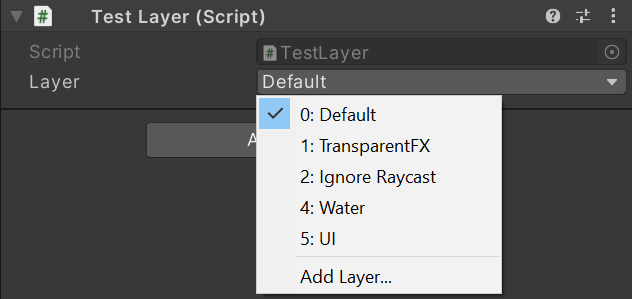

# Layer
Displays a dropdown list of available Layers (must be used with a 'int' typed property).
It offers a single layer selection instead of the multiple LayerMask selection.

## How to use
Put the attribute in front of a property.

## Examples
```cs
[Layer]
public int _layer;
```

