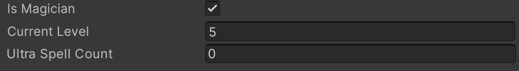

# ShowPropConditional
Shows or hides a property based on a bool method.

## How to use
Put the attribute in front of a property.<BR/>

## Examples
```cs
[SerializeField] private bool _isMagician;
[SerializeField]private int _currentLevel;
[SerializeField][ShowPropConditional("ShowUltraSpellProp")] private int _ultraSpellCount;

private bool ShowUltraSpellProp()
{
	return _isMagician && _currentLevel > 3;
}
```

